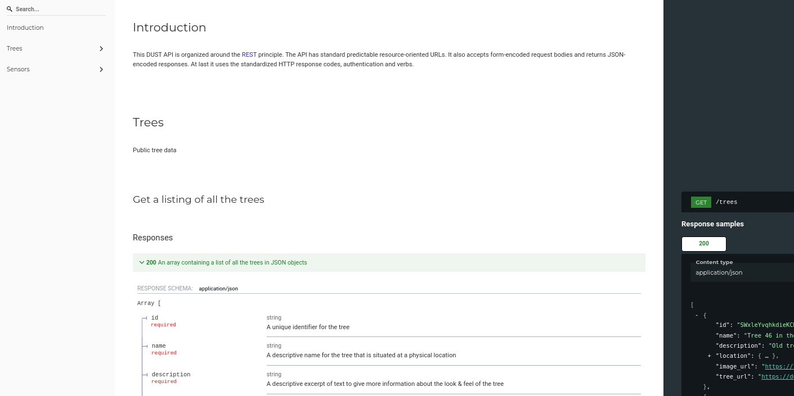
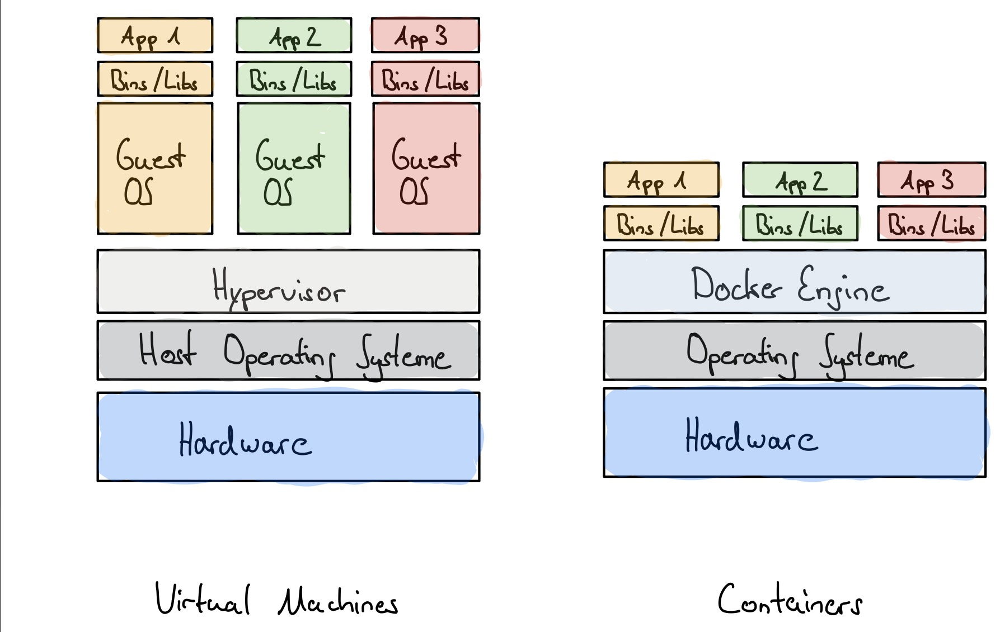
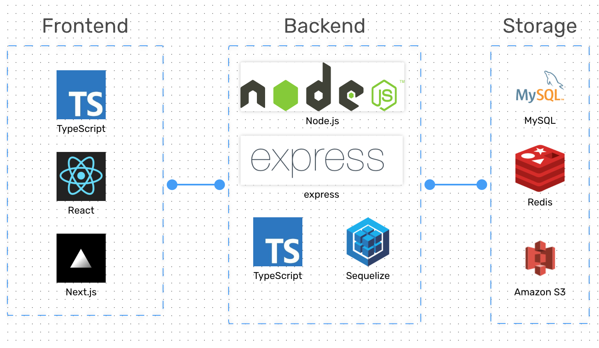

# Blog

De bedoeling van de blog pagina is dat je elke week een kleine samenvatting voorziet van je werk van de afgelopen week. Een foto, diagram, ... is steeds aangeraden.

# Week 3

De REST API begint nu stilaan vorm te krijgen. De meeste routes zijn reeds voorzien. Authenticatie laten we voorlopig nog achterwege. Voor de documentatie van de API werd er gekozen om te werken met [Redocly](https://redocly.com)

# Week 2

De focus van deze week lag op de integratie van de volledige stack. Door alle services te voorzien als docker containers ....

# Week 1

Voor de backend werd er geopteerd om verder te gaan met Express ..... Samen met de promotor van het bedrijf xxx werd een diagram opgesteld van de volledige stack van onze webapplicatie.

