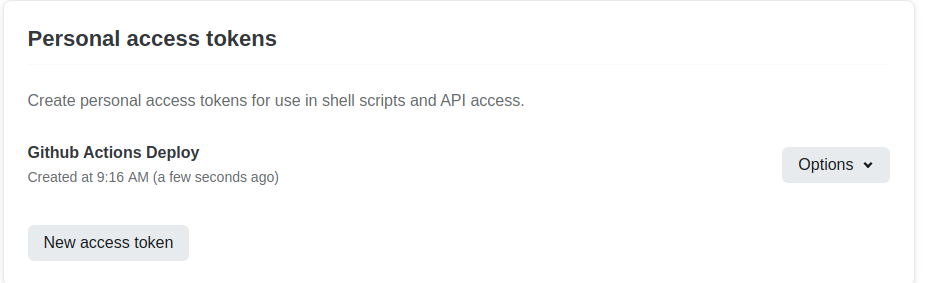

# Netlify Deploy

:::warning Disable deze pagina
Eens je thesis zijn einde nadert, mag je deze pagina uit het navigatiemenu halen. Dit kan je doen in `docs/.vuepress/config.js`
:::

## Private Repos

As of september 2022, netlify does not allow free accounts to deploy websites from a private repo. This can be fixed by using Github actions to build the web site into static files and push them to netlify.

To build the website using github actions and deploy it on netlify we use the `.github/workflows/build_vuepress.yml` file.

Start by creating a website on Netlify. We'll start by creating a website from the original template of this thesis. This because we need a public starter repository. We'll unlink it later and deploy from GitHub.

Go to netlify and select `Add new site => Import Existing Project => Github`.

Select the repository `vives-elektronics-ict-bachelor-thesis/bachelor-thesis-vuepress-template`.

Leave all settings to their default values and click `Deploy website`.

Next you will need to setup a personal access token on netlify via [https://app.netlify.com/user/applications#personal-access-tokens](https://app.netlify.com/user/applications#personal-access-tokens).

The netlify site ID can be found at `team page > your site > Settings > Site details > Site information > API ID`

You need to set these secrets on GitHub via `repo => Settings => Secrets`.

You should also stop the build process on netlify: `Site Settings => Build & deploy => Build Settings`.

Also unlinked the repo in `Site Settings => Build & deploy => Continuous Deployment`.
