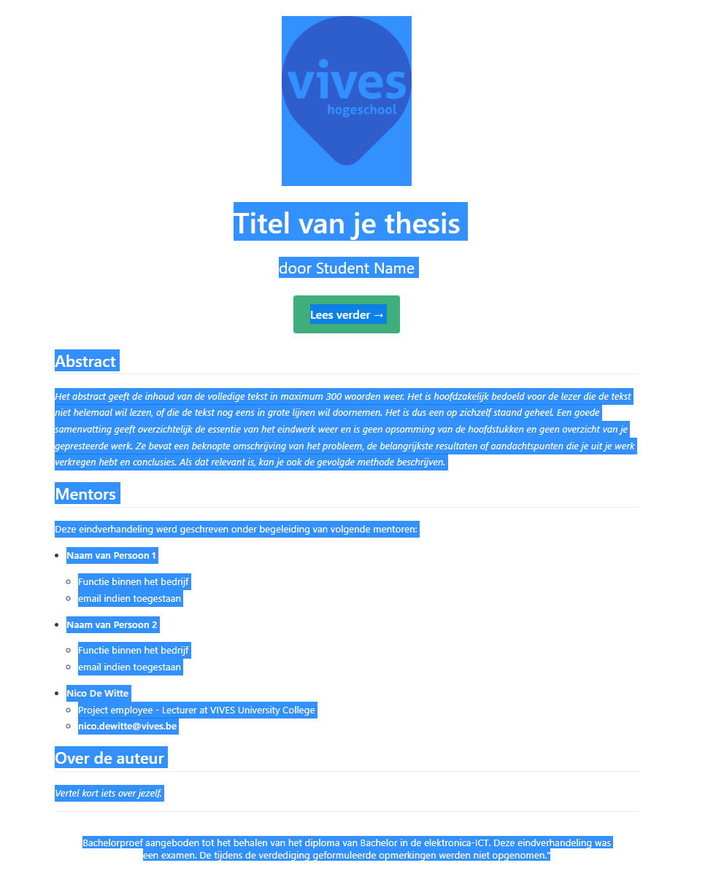
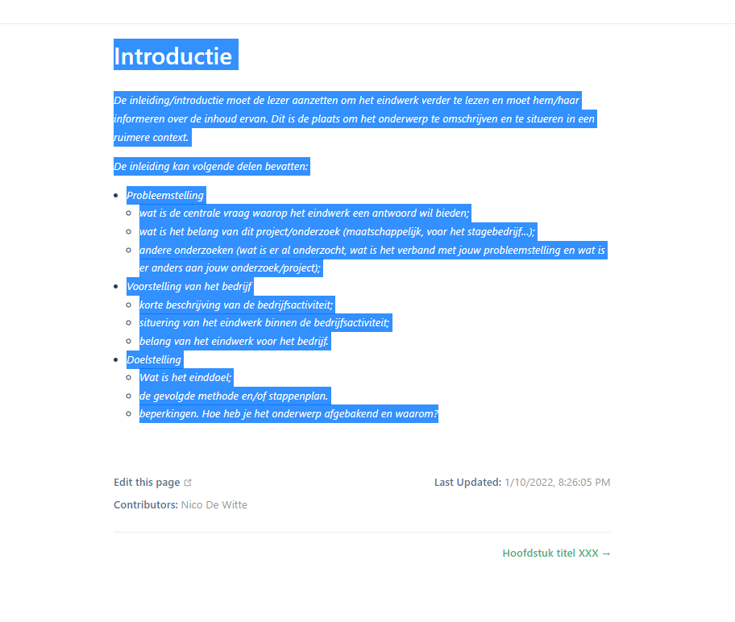

# PDF Genereren

:::warning Disable deze pagina
Eens je thesis zijn einde nadert, mag je deze pagina uit het navigatiemenu halen. Dit kan je doen in `docs/.vuepress/config.js`
:::

Om een PDF van de thesis te genereren zal er moeten worden gewerkt in een aantal stappen.

In eerste instantie dienen het abstract en de hoofdstukken te worden "geprint" als PDF. Daarnaast zal ook het voorblad (zie Toledo) dienen te worden geconverteerd naar PDF vanuit Word.

Vervolgens kunnen de verschillende PDF's worden samengevoegd met de Adobe Acrobat DC tool.

## Abstract en Hoofdstukken

Om het abstract en de afzonderlijke hoofdstukken om te zetten naar PDF kan er best worden gewerkt met Chrome.

Surf naar je netlify website start met het abstract.

Selecteer vanaf het VIVES logo tot en met de tekst onderaan "Bachelorproef aangeboden tot ...". Doe dit manueel. Niet met `CTRL-A` want dan selecteer je ook de navigatie enzo.

Druk vervolgens de toetsencombinatie `CTRL-P` in om het afdrukvenster van Chrome op te roepen. Nu dien je zorgvuldig volgende aanpassingen te doen:

* `Destination`: `Save as PDF`
* `Paper Size`: `A4`
* `Paper Size`: `A4`
* `Options`: `Selection Only`

Druk vervolgens op `Save` en sla de output op als `abstract.pdf` in de directory `pdf` van je repository.

Vervolgens doe je net hetzelfde voor de verschillende hoofdstukken. Nog even als voorbeeld voor de introductie:

Zorg ervoor dat je vanaf de hoofdtitel tot de laatste paragraaf hebt geselecteerd. Zie dat je de footer niet mee hebt (edit this page, contributors, ...)

Genereer nu opnieuw de PDF via `CTRL-P` en sla het bestand op als `00-introductie.pdf`.

De volgende hoofdstukken ga je ook telkens mooi nummeren.

::: warning Inhoud en images
Merk op dat je als student zelf verantwoordelijk bent om de output na te kijken. Je dient hierbij extra aandacht te besteden aan eventueel ontbrekende afbeeldingen.
:::

## Voorblad

Het voorblad voor de thesis is terug te vinden op Toledo als een Microsoft Word document. Je dient hier jouw gegevens in te vullen.

Zodra je dit hebt gedaan kan je een PDF genereren van de Word file.

Plaats het resultaat in de directory `pdf` met de naam `voorblad.pdf`.

## Genereren Eindresultaat

Eens alle afzonderlijke delen werden gegenereerd kan een volledige PDF worden gecreëerd met een tool zoals Adobe Acrobat DC. Als student heb je deze tool echter niet ter beschikking. De docent zal dus de PDF dienen te genereren.

Zodra je Adobe Acrobat DC opent kan je kiezen om de `Combine` tool te starten.

Hier dien je vervolgens gewoon de verschillende PDF's in de juiste volgorde te plaatsen na het inladen.

Kies bij `Options` voor een `Large file size`. Zo behoud je de maximale kwaliteit van de afbeeldingen.

Druk vervolgens op `Combine`. Je krijg nu het resultaat te zien van de samenvoeging.

Vervolgens kies je rechts voor de tool `Edit PDF`.

Je kan nu de `Lees verder` knop en tekst van Vuepress verwijderen:

Als laatste dienen er nu nog pagina te worden toegevoegd.

Klik bovenaan op `Header & Footer` en kies voor de optie `Add`.

Kies eerst voor `Page number and Date Format`.

Kies nu voor `Page Number Format` het formaat `1/n`.

Vervolgens dienen we aan te geven dat er pas na het voorblad mag worden genummerd. Dit kan je instellen via `Page Range Options`:

Kies hierbij om de sectie te starten vanaf page 2:

Click nu vervolgens in de `Center Footer Text` en klik dan op de knop `Insert Page Number`.

Als je wil kan je deze pagina-nummering opslaan als een `Setting`, dan kan je dit later makkelijker opnieuw toepassen:

Klik op `Ok` en sla het resultaat op als `thesis-<bedrijf>-<student>-<jaartal>.pdf` in de directory `pdf`.

Commit en push de finale pdf.

::: warning Eindresultaat Student
Het is de verantwoordelijkheid van de student om het eindresultaat grondig na te kijken. Indien er zich problemen of fouten voordoen, verwittig dan je VIVES mentor ruimschoots op tijd zodat een nieuwe PDF kan worden gegenereerd.
:::
